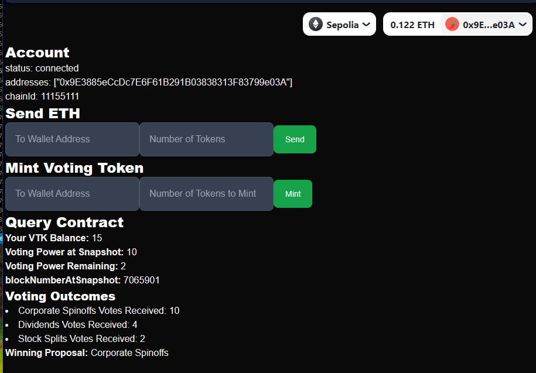

# Encode Club EVM Bootcamp Group 2, Assignment 4: Browser-based Voting dApp

- [Encode Club EVM Bootcamp Group 2, Assignment 4: Browser-based Voting dApp](#encode-club-evm-bootcamp-group-2-assignment-4-browser-based-voting-dapp)
  - [Overview](#overview)
- [Install Process](#install-process)
- [Key Learnings](#key-learnings)
- [Study Notes](#study-notes)
  - [1. Next.js Variables](#1-nextjs-variables)
  - [2 Viem "Under the Hood"](#2-viem-under-the-hood)
    - [`sendTransaction` vs `writeContract`](#sendtransaction-vs-writecontract)
  - [3. Create a Viem Wallet Client With a Built-in Public Client](#3-create-a-viem-wallet-client-with-a-built-in-public-client)
  - [4. Simplifying Code With the `Contract` Object](#4-simplifying-code-with-the-contract-object)
  - [5. Deploy](#5-deploy)
    - [Deployed Contract Address Retrieval](#deployed-contract-address-retrieval)
  - [6. Creating Contract Object](#6-creating-contract-object)
  - [7. Observing Events and Filters With Viem](#7-observing-events-and-filters-with-viem)

## Overview 

This Browser-based Voting dApp takes the Tokenized Ballot project of week 4 and integrates it with a web-based frontend.

Next.js was because it allows for rapid project prototyping:  Server and client-side are natively included. Rainbowkit was used for browser based wallet integration, while wagmi did the heavy lifting as wrapper for Viem.

The application reads voting results and mints tokens to new users.  Below is the screenshot for a connected wallet that voted:




# Install Process
The project was initialized via:

```
$ pnpm create next-app@latest ballot5
$ cd ballot5 
$ pnpm install @rainbow-me/rainbowkit wagmi viem@2.x @tanstack/react-query
$ pnpm install @wagmi/core
```

Github repo name is `erc20votes-part2`

# Key Learnings

React renders DOM elements multiple times.  To prevent React from attempting to render an element containing a variable that is `undefined`, conditional shortcut operators such as the following should  be used: `<div><b>Your VTK Balance:</b> {balance && (formatEther(balance?.result as bigint))}</div>`

This issue became apparent when attempting to read Voting Power at Snapshot (i.e., `getVotingPower`) which depends on reading a valid `targetBlocknumber` first.

# Study Notes

## 1. Next.js Variables

There are backend and frontend variables.  For frontend, prefix with:  NEXT_PUBLIC_


> Normal environment variables are only available in the Node.js environment, meaning they aren't accessible to the browser (because client runs in a different environment).
 
> In order to make the value of an environment variable accessible in the browser, Next.js can "inline" a value, at build time, into the js bundle that is delivered to the client, replacing all references to process.env.[variable] with a hard-coded value. To tell it to do this, you just have to prefix the variable with NEXT_PUBLIC_.

> [Next.js Docs]( https://nextjs.org/docs/pages/building-your-application/configuring/environment-variables#bundling-environment-variables-for-the-browser)


Environment variables may be chained liked so:

`$export TEST_THEN_DELETE=https://opt-sepolia.g.alchemy.com/v2/$ALCHEMY_API_KEY`

Let's echo the chained variable:

`echo $TEST_THEN_DELETE  

This is the output:

`https://opt-sepolia.g.alchemy.com/v2/aFFGTy3827SGahHH`


## 2 Viem "Under the Hood" 

### `sendTransaction` vs `writeContract`

The below explanation is quoted and paraphrased from [Josh Miller's](https://linkedin.com/in/truemiller) answer on [StackOverflow](https://stackoverflow.com/a/78802248/94695)

> `sendTransaction` allows us to send any arbitrary transaction. This includes contract interactions as well as sending chain-native tokens via the `value` parameter. 

> `writeContract` and its variants solely write data to a contract. Since ERC20 tokens are contracts,  "transferring" is just incrementing a number mapped to the `to` address while decrementing the `from` address.

> Instead of calling writeContract, you may interact directly via the `Contract` object.

[-Josh Miller](https://truemiller.com) 


## 3. Create a Viem Wallet Client With a Built-in Public Client

We usually create a `publicClient` for read transactions and a `walletClient` for write tx.  However, these object instances may be combined into a single `client` object with the `extend` keyword:

```
import { createWalletClient, http, publicActions } from "viem";

const account = privateKeyToAccount(privateKey as Hex);

  const client = createWalletClient({
    account,
    chain: arbitrumSepolia,
    transport: http(process.env.API_URL),
  }).extend(publicActions);
```

See this [YouTube video](https://youtu.be/P9oUqVsHBkA?si=URjgzUHKfebgZ_Bk&t=2096) from Dan Nolan for additional details.

## 4. Simplifying Code With the `Contract` Object

```
import { getContract  } from "viem";

const contract = await getContract({
    address: contractAddress,
    abi,
    client,
});

```

We now have access to all contract methods such as `read`, `write`, `getEvents`, etc:

https://viem.sh/docs/contract/getContract#usage
https://www.youtube.com/watch?v=P9oUqVsHBkA&t=3041s


## 5. Deploy
const hash = await client.deployContract({
    abi,
    bytecode: `0x${bin}`,
    args: [127n],
});

### Deployed Contract Address Retrieval
  `const { contractAddress } = await client.getTransactionReceipt({ hash });`

## 6. Creating Contract Object

```
if (contractAddress) {
    const contract = getContract({
        address: contractAddress,
        abi,
        client,
    });
}

const hash = await contract.write.mint([69420])
const result = await contract.read.totalSupply()
```

## 7. Observing Events and Filters With Viem

https://www.youtube.com/watch?v=P9oUqVsHBkA&t=3227s

```
const logs = await contract.getEvents.Transfer()
const onWatch = contract.watchEvent.Transfer(
  { from: '0xA0Cf798816D4b9b9866b5330EEa46a18382f251e' },
  { onLogs(logs) { console.log(logs) } }
)
```